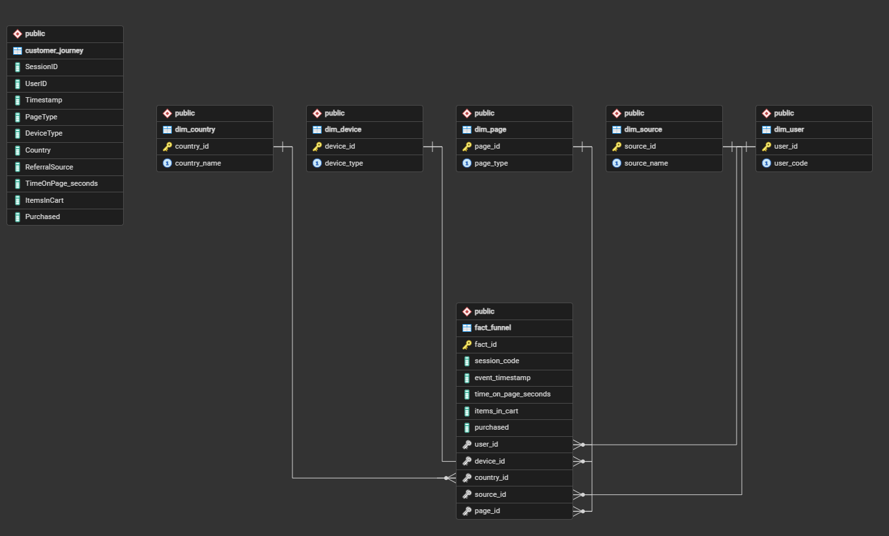

# Ecommerce Funnel Analytics

## 1. Introducción

Este proyecto desarrolla un análisis completo del customer journey en un e‑commerce utilizando SQL, PostgreSQL y Docker.  
Incluye:

- Exploratory Data Analysis (EDA)
- Validación de calidad de datos
- Construcción del funnel de conversión
- Creación de vistas semánticas
- Cálculo de KPIs reales
- Documentación técnica del proceso

El objetivo es construir un pipeline analítico sólido y reproducible que permita entender el comportamiento de los usuarios a lo largo del funnel.

---

## 2. Arquitectura del Proyecto

El proyecto sigue una arquitectura analítica estándar:

RAW → CORE → SEMANTIC → ANALYSIS

- RAW: Datos originales sin transformar  
- CORE: Limpieza, validación y estandarización  
- SEMANTIC: Vistas SQL para análisis  
- ANALYSIS: KPIs, métricas y conclusiones  

### 2.1 Estructura del proyecto

```plaintext
ECOMMERCE-FUNNEL-ANALYTICS/
│
├── data/                       
│   └── customer_journey.csv    # Datos RAW del proyecto (Kaggle)
│
├── init/                        
│   ├── 01_schema.sql           # Creación del esquema y tablas
│   ├── 02_data.sql             # Inserción de datos en las tablas
│   ├── 03_eda.sql              # Exploratory Data Analysis sobre RAW
│   └── 04_dimensional_analysis.sql  # Análisis del funnel sobre FACT + DIM
│
├── pgadmin/                    
│   └── servers.json            # Conexión preconfigurada al servidor PostgreSQL
│
├── .gitignore                  # Archivos y carpetas excluidos del repositorio
├── .sqlfluff                   # Configuración de SQLFluff
├── docker-compose.yml          # Orquestación de PostgreSQL + pgAdmin con Docker
└── README.md                   # Documentación principal del proyecto
```

## 2.2 Diagrama ERD

El siguiente gráfico muestra las relaciones entre las tablas RAW, DIM y FACT del proyecto.



---

## 3. Cómo ejecutar el proyecto

### 3.1 Requisitos previos

#### 3.1.1 Docker
El entorno se levanta completamente mediante Docker, por lo que es necesario tener instalado:

- Docker Desktop (Windows / macOS)
- Docker Engine + Docker Compose (Linux)

#### 3.1.2 PostgreSQL y pgAdmin (incluidos en Docker)
No es necesario instalarlos manualmente.  
El archivo `docker-compose.yml` crea:

- Un contenedor PostgreSQL
- Un contenedor pgAdmin para administración visual

#### 3.1.3 SQLFluff 4.x (opcional pero recomendado)
El proyecto utiliza SQLFluff para validar y formatear SQL.  
Es importante usar **SQLFluff versión 4.x**, ya que la versión 3.x usa un sistema de configuración distinto.

---

### 3.2 Levantar el entorno con Docker

En la raíz del proyecto:

```docker-compose up -d```


Esto levanta:

- PostgreSQL en localhost:5432  
- pgAdmin en localhost:5050  

---

### 3.3 Crear la base de datos

Entrar al contenedor:

```docker exec -it ecommerce-postgres psql -U postgres```


Crear la base de datos:

```CREATE DATABASE ecommerce_db;```

Salir con \q.

---

### 3.4 Ejecutar los scripts SQL

Ejecutar en este orden:

```bash
psql -U postgres -d ecommerce_db -f init/01_schema.sql
psql -U postgres -d ecommerce_db -f init/02_data.sql
psql -U postgres -d ecommerce_db -f init/03_eda.sql
psql -U postgres -d ecommerce_db -f init/04_dimensional_analysis.sql
```

---

### 3.5 Verificar que todo está correcto

```docker exec -it ecommerce-postgres psql -U postgres -d ecommerce_db```

Ejecutar:

```SELECT COUNT(*) FROM customer_journey;```


---

## 4. Análisis SQL

El análisis se divide en dos capas complementarias:

### 4.1 Exploratory Data Analysis (EDA) sobre RAW

El EDA se realiza con `init/03_eda.sql` y trabaja directamente sobre la tabla RAW `customer_journey`.
Incluye:

- Conteo de filas y sesiones
- Rango de fechas y cobertura temporal
- Distribución de `PageType`, `DeviceType`, `Country` y `ReferralSource`
- Validación de la variable objetivo `Purchased`
- Detección de nulos, duplicados y valores fuera de rango
- Comprobación de la consistencia del funnel y del carrito
- Análisis de sesiones incompletas y eventos fuera de orden

### 4.2 Análisis dimensional del funnel

El análisis dimensional se realiza con `init/04_dimensional_analysis.sql` y trabaja sobre el modelo ya poblado:
`fact_funnel` + `dim_user`, `dim_device`, `dim_country`, `dim_source`, `dim_page`.
Incluye:

- Enriquecimiento de los hechos con dimensiones de negocio
- Cálculo de sesiones por paso del funnel
- Análisis de drop-off entre etapas
- Conversion rate global y por dimensiones (`DeviceType`, `Country`, `ReferralSource`)
- Tiempos medios entre pasos del funnel
- Creación de vistas semánticas para reporting

De esta forma, `init/03_eda.sql` se utiliza para explorar y validar los datos RAW, y `init/04_dimensional_analysis.sql` para analizar el funnel desde el modelo dimensional.

### Hallazgos principales

- La calidad de datos RAW es sólida: no hay nulos críticos, duplicados exactos ni valores fuera de rango que afecten el análisis general.
- `Purchased` es consistente por sesión, lo que permite usarlo como métrica fiable de conversión en el pipeline.
- El funnel es lógico y coherente hasta checkout; la excepción sistemática es que `ItemsInCart` se ajusta a 0 en `confirmation`, lo cual corresponde al cierre de la compra.
- El modelo dimensional `fact_funnel` + `dim_*` se puede usar con seguridad para reporting y análisis de KPI.
- La conversión final es aproximadamente del 20 %, con comportamientos similares por dispositivo y diferencias moderadas por país y canal.

### Limitaciones identificadas

- El dataset no incluye información de importe o ticket medio, por lo que el análisis queda centrado en eventos y conversiones, no en valor monetario.
- La variable `ItemsInCart` no refleja el valor del pedido en la etapa `confirmation`, lo que impide análisis de abandono basados en productividad económica.
- El flujo es sintético: algunos patrones de comportamiento ideal de funnel pueden no coincidir con un e-commerce real.

---

## 5. Vistas SQL (Capa Semántica)

Se crean las siguientes vistas para análisis a partir del modelo dimensional:

- vw_dimensional_funnel  
- vw_dimensional_funnel_sessions  
- vw_dimensional_conversion_by_device  
- vw_dimensional_conversion_by_country  
- vw_dimensional_conversion_by_source  

Estas vistas se construyen en `init/04_dimensional_analysis.sql` y son la base para los KPIs del funnel presentados en la siguiente sección.

---

## 6. KPIs del Funnel

Los KPIs del funnel se extraen a partir de las vistas `vw_dimensional_*` creadas en `init/04_dimensional_analysis.sql`.

### 6.1 Conversion Rate Final

| Métrica | Valor |
|--------|--------|
| Sesiones totales | 5000 |
| Sesiones que llegan a confirmation | 1010 |
| Conversion Rate Final | 20.2% |

---

### 6.2 Drop-off por paso del funnel

| Paso | Sesiones | % respecto al anterior |
|------|----------|------------------------|
| home | 5000 | — |
| product_page | 3987 | 79.7% |
| cart | 1599 | 40.1% |
| checkout | 1123 | 70.2% |
| confirmation | 1010 | 89.9% |

---

### 6.3 Conversion Rate por DeviceType

| Device | Home | Confirmation | Conversion |
|--------|------|--------------|------------|
| desktop | 1666 | 339 | 20.35% |
| mobile | 1671 | 337 | 20.17% |
| tablet | 1663 | 334 | 20.08% |

---

### 6.4 Conversion Rate por Country

| País | Home | Confirmation | Conversion |
|------|------|--------------|------------|
| France | 752 | 170 | 22.60% |
| USA | 706 | 147 | 20.82% |
| India | 702 | 145 | 20.65% |
| UK | 739 | 145 | 19.62% |
| Canada | 715 | 140 | 19.58% |
| Australia | 683 | 131 | 19.18% |
| Germany | 703 | 132 | 18.77% |

---

### 6.5 Conversion Rate por ReferralSource

| Canal | Home | Confirmation | Conversion |
|--------|------|--------------|------------|
| google | 1280 | 277 | 21.64% |
| email | 1251 | 251 | 20.06% |
| direct | 1226 | 243 | 19.82% |
| social media | 1243 | 239 | 19.22% |

---

### 6.6 Bounce Rate

| Métrica | Valor |
|--------|--------|
| Sesiones solo home | 1013 |
| Bounce Rate | 20.3% |

---

### 6.7 Tiempos medios entre pasos

| Transición | Tiempo medio |
|------------|--------------|
| home → product_page | 97.06 s |
| product_page → cart | 98.74 s |
| cart → checkout | 96.61 s |

---

## 7. Conclusiones

- La calidad de datos RAW es adecuada para análisis de funnel y conversiones, con pocas inconsistencias críticas.
- La transformación al modelo dimensional es estable y permite separar claramente la exploración de datos de la analítica de negocio.
- El funnel muestra una conversión final sólida (~20 %) y un comportamiento homogéneo por dispositivo, lo que sugiere que la mejora debe venir de la experiencia de compra en lugar de problemas técnicos de canal.
- Existen oportunidades relevantes de segmentación por país y por canal, ya que la conversión varía ligeramente entre ellos.
- El dataset funciona bien para KPI de conversión, aunque no para análisis de facturación, ticket medio o valor transaccional.

---

## 8. Próximos pasos

- Automatizar el pipeline SQL con el orden `01_schema.sql`, `02_data.sql`, `03_eda.sql` y `04_dimensional_analysis.sql`.
- Construir un dashboard o reporte sobre las vistas semánticas `vw_dimensional_*` para seguimiento de conversiones y abandono.
- Extender el análisis con cohortes, segmentación por país/canal/dispositivo y análisis de abandono por etapa.
- Incorporar alertas o pruebas de regresión para detectar cambios en el drop-off del funnel.
- Evaluar modelos predictivos de conversión como siguiente capa analítica.
